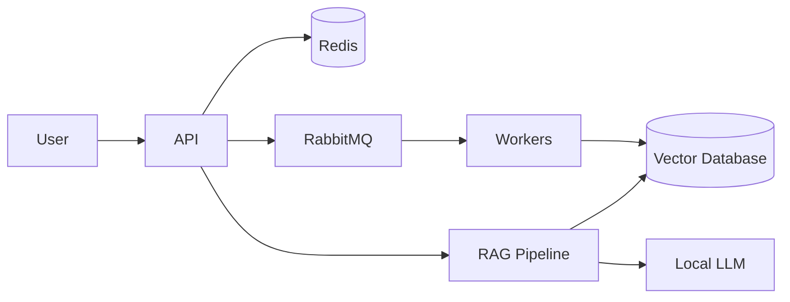

# Status
Project under active development.

---

# LLMOps Platform

Production-oriented LLM application platform built to demonstrate MLOps, LLMOps, DevOps and cloud-native engineering practices.

The goal of this project is to design and implement a scalable AI system using modern production patterns:
- containerization,
- infrastructure as code,
- CI/CD automation,
- observability,
- security hardening,
- asynchronous processing.

The project focuses on engineering practices required to operate AI systems reliably in production environments.

---

# Project Goals

The platform aims to demonstrate:

- designing scalable AI application architecture,
- building RAG-based systems,
- deploying services using containers and Kubernetes,
- implementing automated delivery pipelines,
- monitoring application health and performance,
- securing AI workloads against common threats.

---

# High-Level Architecture

The system will evolve from a simple application into a production-oriented distributed architecture.

Initial architecture:



---

# Planned Technology Stack

## Backend
- Python
- FastAPI
- Pydantic

## AI / LLM
- RAG architecture
- Embeddings
- Vector search
- Local LLM inference

## Data Layer
- Qdrant (Vector Database)
- Redis (Cache)

## Messaging
- RabbitMQ

## Infrastructure
- Docker
- Kubernetes
- Helm
- Terraform

## CI/CD
- Git
- GitLab CI
- Observability
- Prometheus
- Grafana
- OpenTelemetry
- Testing
- Pytest
- Locust / Gatling

## Security
- Kubernetes Secrets
- Sealed Secrets
- JWT authentication
- RBAC
- Network Policies
- Threat modeling
- Prompt injection testing

---

# Project Roadmap

## Phase 1 — Foundation
Current phase.
- repository setup
- development environment
- project structure
- documentation baseline

## Phase 2 — Application Core
- API service
- RAG pipeline
- document ingestion
- vector search

## Phase 3 — Production Architecture
- asynchronous workers
- message queues
- caching
- service separation

## Phase 4 — Cloud Native Deployment
- Docker
- Kubernetes
- Helm
- Terraform

## Phase 5 — Operations
- monitoring
- tracing
- load testing
- security validation

---

# Local Development

Coming soon.

---

# Documentation

Architecture decisions and technical documentation are available in:
```text
docs/
├── architecture/
├── adr/
└── development/
```
