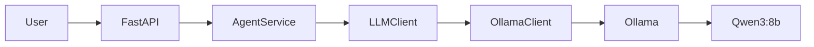

# Current Architecture State

## Current Milestone

**M2 — AI Agent Core**

## Implemented

The current system provides:

- FastAPI API
- AgentService orchestration
- Prompt management
- Multi-conversation management
- LLM provider abstraction
- Ollama integration
- Qwen3:8b local inference
- Docker Compose environment
- NVIDIA GPU acceleration
- Unit and integration tests

## Current Runtime

## Not Yet Implemented

The following capabilities are outside the scope of M2:

- Document ingestion
- Chunking
- Embeddings
- Vector database
- Retrieval
- RAG pipeline
- Message queues
- Redis
- Kubernetes
- Infrastructure as Code
- Production observability

## Next Milestone

**M3 — RAG Pipeline**

The next milestone will introduce document ingestion, chunking, embeddings, vector retrieval and Qdrant integration, allowing the agent to use its own data.