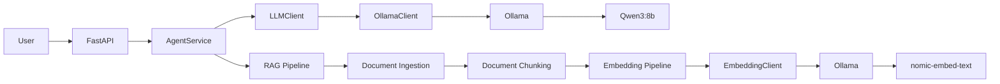

# Current Architecture State

## Current Milestone

**M3 — RAG Pipeline**

## Implemented

The current system provides:

- FastAPI API
- AgentService orchestration
- Prompt management
- Multi-conversation management
- LLM provider abstraction
- Ollama integration
- Qwen3:8b local inference
- Docker Compose environment
- NVIDIA GPU acceleration
- Unit and integration tests
- Document ingestion for TXT, Markdown and PDF files
- Document model with source and metadata
- Single-file and directory ingestion
- Recursive document chunking
- DocumentChunk model
- Embedding provider abstraction
- Ollama embedding integration
- `nomic-embed-text` local embeddings
- EmbeddedChunk model
- EmbeddingService
- RAG pipeline orchestration

## Current Runtime


## RAG Pipeline
The current document processing pipeline is:

```text
Document
    ↓
Document Ingestion
    ↓
Document Chunking
    ↓
Embedding Pipeline
    ↓
EmbeddedChunk
```

Documents are loaded from the local filesystem and split into smaller
chunks using the configured chunking strategy.

Each chunk is converted into a vector embedding using the local
nomic-embed-text model served through Ollama.

The embedding provider is accessed through the EmbeddingClient
abstraction, allowing the underlying implementation to be replaced
without changing the embedding service.

The current pipeline generates embeddings but does not persist them yet.

## Not Yet Implemented

The following capabilities are still planned:

- Qdrant vector database
- Vector storage
- Vector retrieval
- RAG context injection
- RAG evaluation
- Message queues
- Redis
- Kubernetes
- Infrastructure as Code
- Production observability

## Next Milestone Task

Deploy Qdrant

The next step is to introduce Qdrant as the vector database for persistent
storage and later retrieval of document embeddings.