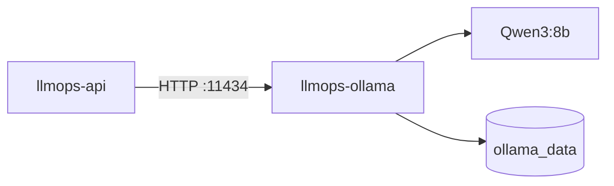
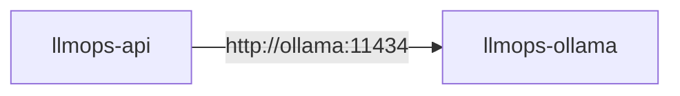

# Docker Compose

## Overview

Docker Compose is used to run the application and its local LLM runtime as separate containers.

## Architecture



## Services

### API (`api`)

- Container: `llmops-api`
- Port: `8000`
- Purpose: exposes the application API and communicates with the LLM runtime.

### Ollama (`ollama`)

- Container: `llmops-ollama`
- Port: `11434`
- Model: `qwen3:8b`
- Purpose: Provides local LLM inference services.
- Internal Endpoint:** `http://ollama:11434`

** Note: The API must not use `localhost:11434` to communicate with Ollama from inside the container. **

### Qdrant (`qdrant`)

- Container: `llmops-qdrant`
- Port: `6333`
- Purpose: Provides vector storage and similarity search capabilities.

## Persistence

Ollama models are stored in the `ollama_data` Docker volume.

This allows downloaded models to persist when the containers are stopped or recreated.

## GPU

The Ollama container is configured to use the host NVIDIA GPU for local model inference.

GPU acceleration allows the Qwen3:8b model to run using the available local GPU.

## Networking

Docker Compose creates a private network for the services.

The services can communicate with each other using their Compose service names.



The API is exposed to the host through port `8000`.

Ollama is exposed through port `11434` for local development and debugging.

## Starting the Environment

Build and start the services:

```bash
docker compose up --build -d
```

Check the running services:

```bash
docker compose ps
```

Check the available Ollama models:

```bash
docker compose exec ollama ollama list
```

## Stopping the Environment

Stop and remove the containers:

```bash
docker compose down
```

The `ollama_data` volume is preserved unless explicitly removed.