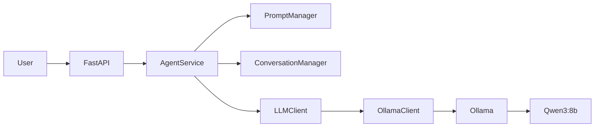

## System architecture

## Components

### FastAPI

HTTP API layer.

### AgentService

Core orchestration layer responsible for coordinating the agent components.

### PromptManager

Builds messages sent to the LLM.

### ConversationManager

Maintains conversation history and isolates conversations.

### LLMClient

Abstraction for LLM providers.

### OllamaClient

Implementation of LLMClient using Ollama.

### Ollama

Local LLM runtime hosting Qwen3:8b.