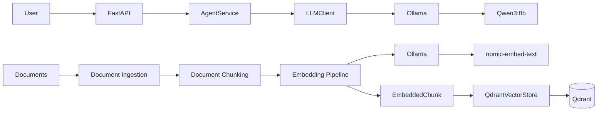

# Current Architecture State

## Current Milestone

**M3 — RAG Pipeline**

## Implemented

The current system provides:

- FastAPI API with agent and conversation management
- LLM provider abstraction with local Ollama / Qwen3:8b inference
- Docker Compose environment with NVIDIA GPU acceleration
- Document ingestion for TXT, Markdown and PDF files
- Recursive document chunking
- Local embedding generation using Ollama / `nomic-embed-text`
- Vector storage and similarity retrieval using Qdrant
- RAG pipeline orchestration for document indexing and retrieval
- Context injection of retrieved chunks into the LLM prompt
- Retrieval evaluation using a controlled evaluation dataset
- Recall@K evaluation with an initial Recall@1 baseline of 0.66 across 3 evaluation cases
- End-to-end RAG integration testing
- Unit and integration test coverage

## Current Runtime


## RAG Pipeline
The current document processing pipeline is:

```text
Document
    ↓
Document Ingestion
    ↓
Document Chunking
    ↓
Embedding Pipeline
    ↓
EmbeddedChunk
```
At query time:
```text
User Query
    ↓
Embedding Generation
    ↓
Vector Retrieval
    ↓
DocumentChunk[]
    ↓
ContextBuilder
    ↓
LLM Prompt
    ↓
LLM Response
```
Documents are loaded from the local filesystem and split into smaller
chunks using the configured chunking strategy.

Each chunk is converted into a vector embedding using the local
nomic-embed-text model served through Ollama.

Document embeddings are persisted in Qdrant and can be retrieved using
vector similarity search.

The EmbeddingClient abstraction separates embedding generation from
the underlying provider implementation.

The Retriever abstraction separates retrieval logic from the vector
database implementation.

Retrieved document chunks are formatted by ContextBuilder and injected
into the prompt sent to the LLM.

Retrieved context is treated as request-scoped data and is not persisted
as part of the conversation history.

## Not Yet Implemented

The following capabilities are still planned:

- Message queues
- Redis
- Observability
- Kubernetes
- Infrastructure as Code
- Production observability

## Evaluation

The current retrieval evaluation uses a controlled dataset containing
three queries with known relevant source documents.

The current baseline is:

```Recall@1 = 0.66```

across three evaluation cases.

An end-to-end integration test additionally verifies that a real query
can retrieve the expected document from Qdrant and produce an LLM response.

## Next Milestone Task

M4 — Async Processing & Backend Architecture

The next milestone focuses on evolving the current application into a
more production-oriented backend architecture with clearer service
boundaries, asynchronous processing and independently scalable components.